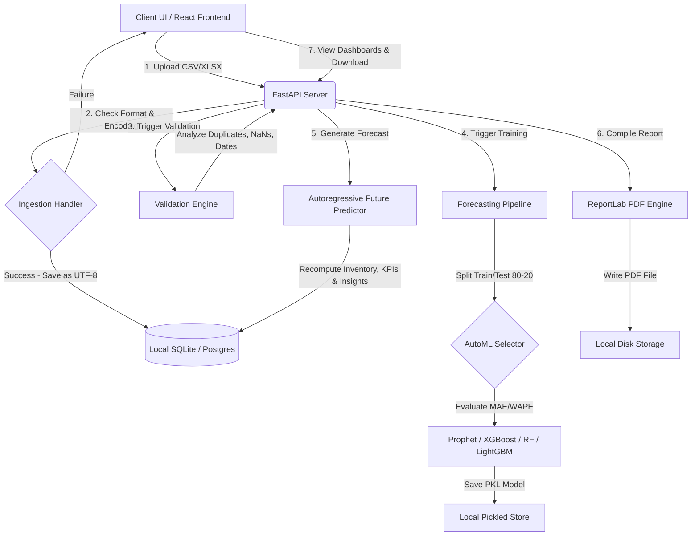

# Predictive Sales Intelligence & Inventory Optimization System

[](https://fastapi.tiangolo.com/)
[](https://react.dev/)
[](https://www.docker.com/)
[](https://scikit-learn.org/)
[](https://facebook.github.io/prophet/)

An end-to-end predictive analytics platform designed to solve retail supply chain inefficiencies. The system ingests transactional sales data, automatically validates and cleans it, trains multiple time-series machine learning models, projects demand horizons, and generates optimal safety stock levels and reorder parameters.

---

## Overview

### The Problem
Traditional business intelligence systems only report **retrospective (historical) sales trends**, leaving inventory managers blind to shifting future demands. This leads to costly stockouts on high-demand items and capital wastage from overstocking slow-moving products.

### The Solution
**Predictive Sales Intelligence System** bridges the gap between historical telemetry and operational execution. By utilizing predictive time-series forecasting, it dynamically calculates:
* **Future Demand Horizons**: Multi-day demand predictions using optimized algorithms.
* **Operational Safety Stock Levels**: Standardized deviation-based buffers that adjust to supply volatility.
* **AI Reorder Thresholds**: Proactive triggers advising replenishment quantities before stockouts occur.

---

## Features

* **Multi-Format Ingestion Wizard**: Supports CSV, XLS, and XLSX file uploads with multi-encoding fallback parsing (`utf-8`, `utf-8-sig`, `cp1252`, `latin1`).
* **Automated Data Quality Validation**: Scans files for missing fields, invalid date structures, duplicated records, and type consistency.
* **AutoML Model Selection**: Automatically trains, evaluates, and selects the best model per product among **XGBoost**, **LightGBM**, **Random Forest**, and **Facebook Prophet** based on Mean Absolute Error (MAE).
* **Composed Dashboard Charts**: Renders daily billing timelines and unit shipping volumes side-by-side using dual-axes visual alignment.
* **Inventory Risk Monitor**: Flags critical stockouts and reorder-point infractions with visual severity levels.
* **PDF Executive Reports**: Auto-generates downloadable letter-format PDF summaries with KPIs and SKU reorder lists.

---

## Tech Stack

| Component | Technologies | Description |
| :--- | :--- | :--- |
| **Frontend** | React 19, TypeScript, Vite, TailwindCSS, Framer Motion | High-performance, fully-typed UI with micro-animations and responsive layouts. |
| **Charts** | Recharts | Interactive canvas visualization with dual-axis charting and gradient areas. |
| **Backend** | FastAPI, Uvicorn, Celery, Pydantic, SQLAlchemy, Alembic | Async python server layer supporting database migrations and schema validation. |
| **Database** | PostgreSQL, SQLite | Structured data persistence for metrics, products, and activity logs. |
| **ML Engine** | Pandas, NumPy, Scikit-Learn, XGBoost, LightGBM, Prophet | Feature engineering, autoregressive prediction loops, and model pickling. |
| **DevOps** | Docker, Docker Compose | Containerized service orchestration for isolated frontend and backend deployments. |

---

## System Architecture



---

## Screenshots

*Screenshots of the functional application dashboard are stored inside the `walkthrough` artifacts folder:*

* **Dashboard Overview**: 
* **Product Standings**: 
* **Category Breakdown**: 

---

## Project Structure

```bash
Predictive-Sales-Intelligence-System/
├── backend/
│   ├── api/                # API Route endpoints (auth, forecast, products, etc.)
│   ├── core/               # Security, jwt tokens, celery configuration
│   ├── db/                 # SQLAlchemy schemas, models, and sessions
│   ├── ml/                 # Data cleansing & AutoML pipelines
│   ├── worker/             # Background task worker handlers
│   ├── main.py             # FastAPI backend entrypoint
│   └── requirements.txt    # Python package dependencies
├── frontend/
│   ├── public/             # SVGs and static visual resources
│   ├── src/
│   │   ├── components/     # Layouts, headers, charts, and monitors
│   │   ├── pages/          # Full page views (Analytics, Dashboard, Upload)
│   │   ├── lib/            # Axios API wrappers
│   │   └── App.tsx         # Router configuration and application setup
│   ├── package.json        # Frontend node packages list
│   └── vite.config.ts      # Vite compilation configuration
├── docker/                 # Containerization setup files
│   ├── Dockerfile.backend
│   └── Dockerfile.frontend
├── docker-compose.yml      # Multi-container local orchestration configuration
└── README.md
```

---

## Installation

### Prerequisites
* **Python**: `3.11+`
* **NodeJS**: `24.x+` (with `npm` package manager)
* **Docker** (Optional, for containerized execution)

### 1. Clone the Repository
```bash
git clone https://github.com/abhiram073/Predictive-Sales-Intelligence-System.git
cd Predictive-Sales-Intelligence-System
```

### 2. Local Backend Setup
1. Navigate to the backend directory and create a virtual environment:
   ```bash
   cd backend
   python -m venv .venv
   source .venv/bin/activate  # On Windows, use: .venv\Scripts\activate
   ```
2. Install Python dependencies:
   ```bash
   pip install -r requirements.txt
   ```
3. Set up environment variables in a `.env` file inside the `backend` folder:
   ```env
   DATABASE_URL="sqlite:///./test.db"
   REDIS_URL="redis://localhost:6379/0"
   JWT_SECRET="your_secure_development_jwt_secret"
   ```
4. Start the FastAPI development server:
   ```bash
   python -m uvicorn main:app --host 127.0.0.1 --port 8000 --reload
   ```

### 3. Local Frontend Setup
1. Open a new terminal tab, navigate to the frontend directory:
   ```bash
   cd frontend
   npm install
   ```
2. Run the Vite development server:
   ```bash
   npm run dev
   ```
3. Access the web interface at [http://localhost:5173/](http://localhost:5173/).

---

## Docker Compose Setup (Production / Orchestrated Mode)
If you have Docker Desktop installed, you can spin up the full infrastructure (FastAPI, React, PostgreSQL, Redis, and Celery Worker) using a single command:
```bash
docker compose up --build
```
* **Frontend port**: `5173`
* **Backend port**: `8000`

---

## Machine Learning Pipeline

```
[Raw Ingestion] ➔ [Cleansing (NaNs & Outliers)] ➔ [Feature Engineering] ➔ [AutoML Selection] ➔ [Pickle Dump]
```

### 1. Data Cleaning
* Drop rows missing critical indexes (`date`, `product_id`).
* Cap outliers in units sold per SKU using the **Interquartile Range (IQR)** method (`[Q1 - 1.5*IQR, Q3 + 1.5*IQR]`) to prevent demand anomalies from skewing models.

### 2. Feature Engineering
The pipeline constructs time-series features based on the historical date index:
* **Time Components**: Year, Month, Quarter, Day, Day of Week, and Weekend indicators.
* **Autoregressive Lags**: Shifts units sold back by 1 day (`lag_1`), 7 days (`lag_7`), and 14 days (`lag_14`).
* **Rolling Statistics**: Computes rolling averages for 7-day and 14-day windows.

### 3. Training & Evaluation Workflow
* The dataset is split into **80% training** and **20% testing** sets.
* Candidate algorithms (Random Forest, XGBoost, LightGBM, Prophet) are trained and validated.
* The model with the lowest **Mean Absolute Error (MAE)** is saved to the pickled storage directory (`models/model_[dataset_id].pkl`).

---

## API Documentation

The backend includes auto-generated Swagger interactive docs at `http://localhost:8000/docs`.

### Key Endpoints

| Endpoint | Method | Params | Description |
| :--- | :--- | :--- | :--- |
| `/api/v1/forecasting/upload-dataset` | `POST` | Multipart Form `file` | Uploads CSV/XLSX file, saves as UTF-8 |
| `/api/v1/forecasting/validate-dataset` | `POST` | JSON `{ dataset_id: int }` | Validates column counts and data quality |
| `/api/v1/forecasting/train-model` | `POST` | JSON `{ dataset_id: int, model_type: str }` | Trains selected ML algorithms |
| `/api/v1/forecasting/generate-forecast`| `POST` | JSON `{ dataset_id: int, horizon_days: int }` | Forecasts demand, updates DB indicators |
| `/api/v1/forecasting/dashboard` | `GET` | None | Returns calculated KPIs, trends, and top products |
| `/api/v1/forecasting/reports/download/{id}`| `GET` | Path `id` | Generates and downloads PDF executive report |

---

## Future Enhancements
* **Real-time Webhook Alerts**: Push low-stock warnings directly to corporate communication channels (Slack, Microsoft Teams).
* **Multi-Warehouse Distribution Support**: Extend the inventory forecasting pipeline to support multiple stock locations with location-routing calculations.
* **Pricing Elasticity Simulators**: Incorporate pricing variations into the feature engineering pipeline to optimize revenue alongside demand forecasts.

---

## Contributing
1. Fork the Project.
2. Create a Feature Branch (`git checkout -b feature/NewIntelligence`).
3. Commit your Changes (`git commit -m 'feat: add pricing elasticity model'`).
4. Push to the Branch (`git push origin feature/NewIntelligence`).
5. Open a Pull Request.

---

## License
Distributed under the MIT License. See `LICENSE` for more information.

---

## Author
* **Abhiram** - *Full Stack Developer & ML Engineer* - [GitHub Portfolio](https://github.com/abhiram073)

## Acknowledgements
* Facebook Prophet Team
* Scikit-Learn Open Source Community
* FastAPI Framework creators
